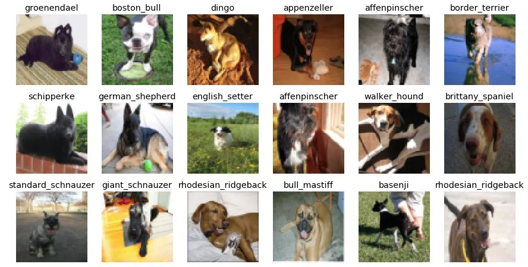

# Dog Breed Prediction

## Table of Content

* [Overview](#overview)
* [Motivation](#motivation)
* [Problem Solving steps](#Problem-Solving-steps)

## Overview

In this project, we used `Keras` and `TensorFlow` to build train and test an Convolutional Neural Network capable of identifying the breed of a dog in an image. This is a supervised learning problem, specifically a multi-class classification problem.  

## Motivation

This project model can be used to predict different brreds of  dogs which can be further used by different NGOs and organizations working to save animals and for educational purposes.

## Problem Solving steps

1. Load the data from kaggle
2. Load the labels `csv` fro labels that contain image ID and breed
3. Check the breed count
4. One-hot-encoding on labels data prediction column
5. Load the images, convert them to array s, and normalize them
6. Check the shape and size of the X and Y data
7. Build the model network architechture
8. Split the data and fit it into a model and create and accuracy plot
9. Evaluate the model for accuracy score
10. Use the model for prediction

